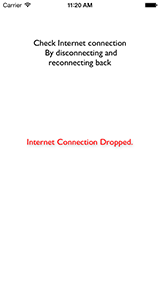
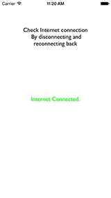

# NetworkManager-ObjC

[](https://travis-ci.org/rahul-apple/NetworkManager-ObjC)
[](http://cocoapods.org/pods/NetworkManager-ObjC)
[](http://cocoapods.org/pods/NetworkManager-ObjC)
[](http://cocoapods.org/pods/NetworkManager-ObjC)

## Usage


To run the example project, clone the repo, and run `pod install` from the Example directory first.

A class Designed for Check Internet connection.Written for iOS, Objective-C, Cocoa Touch, iPhone, iPad.
Usage:
Add This In Your Podfile

```ruby
pod "NetworkManager-ObjC"
```
update pod
```ruby
pod update
```
Add to Your ViewController

#1.)DELGATE - METHODS

```
#import<NetworkManager.h>

@interface kViewController : UIViewController<NetworkManagerDelegate>{

}


NetworkManager *manager;
manager =[NetworkManager startManager];
manager.delegate=self;
```


Implement These Methods:

```
-(void)netWorkConnectionDropped:(kNetworkStatus)netStatus{
    //Method Gets Called When Internet connection Gets Dropped.!
}
-(void)netWorkConnectionConnected:(kNetworkStatus)netStatus{
    //Method Gets Called When Internet Connected Back.!
}
```


#2.)NOTIFICATION REGISTER - METHODS
```
#import<NetworkManager.h>

@interface kViewController : UIViewController{

}

-(void)viewWillAppear:(BOOL)animated{

//.......
NetworkManager *manager;
manager =[NetworkManager startManager];
manager.typeSelected =NOTIFICATION_REGISTER;
[[NSNotificationCenter defaultCenter] addObserver:self selector:@selector(networkDisConnected:) name:@"NetworkDisConnected" object:nil];
[[NSNotificationCenter defaultCenter] addObserver:self selector:@selector(networkConnected:) name:@"NetworkConnected" object:nil];

//.......

}


-(void)networkDisConnected:(NSNotification *)notification{
    //Method Gets Called When Internet connection Gets Dropped.!
}
-(void)networkConnected:(NSNotification *)notification{
    //Method Gets Called When Internet Connected Back.!
}


```


refer the example for More Details





## Installation

NetworkManager-ObjC is available through [CocoaPods](http://cocoapods.org). To install
it, simply add the following line to your Podfile:

```ruby
pod "NetworkManager-ObjC"
```

## Author

rahul-apple, rahulthazhuthala@gmail.com
- [Facebook][] Rahul Ramachandra
[Facebook]:https://www.facebook.com/hijaz3710

## License

NetworkManager-ObjC is available under the MIT license. See the LICENSE file for more info.
